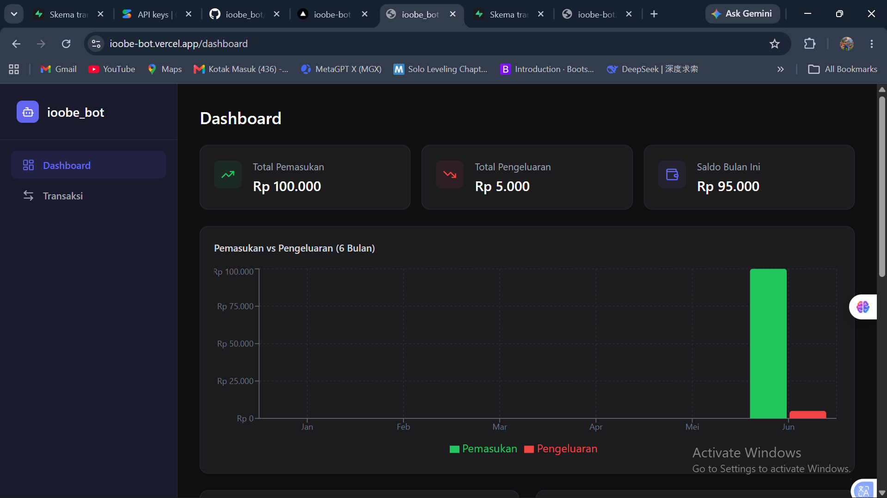

# ioobe_bot — Personal Finance Tracker

Aplikasi pencatat keuangan pribadi berbasis **Telegram Bot + AI + Web Dashboard**. Catat transaksi cukup dengan chat ke bot, lihat grafik dan laporan di dashboard modern.

---

## ✨ Fitur

| Fitur                 | Deskripsi                                                         |
| --------------------- | ----------------------------------------------------------------- |
| **Telegram Bot**      | Input transaksi via chat natural                                  |
| **AI Parsing**        | Gemini AI otomatis mengekstrak tipe, nominal, kategori dari pesan |
| **Fallback Parser**   | Local parser jika kuota AI habis                                  |
| **Web Dashboard**     | Grafik pemasukan/pengeluaran, pie chart kategori, tren saldo      |
| **Riwayat Transaksi** | Tabel lengkap dengan filter, search, pagination                   |
| **Tambah Manual**     | Form input transaksi langsung dari web                            |
| **AI Insight**        | Analisis keuangan otomatis oleh Gemini                            |
| **Responsive**        | Bisa diakses dari HP                                              |

---

## 🧱 Tech Stack

- **Frontend + Backend**: [Next.js 14](https://nextjs.org/) (App Router)
- **Database**: [Supabase](https://supabase.com/) (PostgreSQL)
- **Telegram Bot**: [node-telegram-bot-api](https://github.com/yagop/node-telegram-bot-api)
- **AI Parsing**: [Google Gemini API](https://ai.google.dev/)
- **Grafik**: [Recharts](https://recharts.org/)
- **Styling**: [Tailwind CSS](https://tailwindcss.com/)
- **Hosting**: [Vercel](https://vercel.com/)

---

## 📁 Struktur Project

```
ioobe_bot/
├── app/
│   ├── layout.jsx                    # Shared layout (Sidebar + Footer + konten)
│   ├── page.jsx                      # Redirect ke /dashboard
│   ├── globals.css                   # Tailwind + custom styles
│   ├── dashboard/page.jsx            # Dashboard utama
│   ├── transactions/page.jsx         # Riwayat transaksi
│   └── api/
│       ├── transactions/route.js     # CRUD transaksi
│       ├── summary/route.js          # Data grafik dashboard
│       ├── insight/route.js          # AI insight Gemini
│       └── telegram/webhook/route.js # Webhook Telegram
├── components/
│   ├── Sidebar.jsx                   # Navigasi (fixed + responsive hamburger)
│   ├── Footer.jsx                    # Footer "Dibuat dengan ❤️ Oleh Io Obe"
│   ├── SummaryCard.jsx               # Card ringkasan
│   ├── TransactionTable.jsx          # Tabel transaksi
│   ├── AddTransactionModal.jsx       # Modal tambah manual
│   └── charts/
│       ├── IncomeExpenseBar.jsx      # Bar chart 6 bulan
│       ├── CategoryPie.jsx           # Pie chart kategori
│       └── TrendLine.jsx             # Line chart saldo
├── lib/
│   ├── supabase.js                   # Koneksi Supabase
│   ├── gemini.js                     # AI parser + insight
│   └── telegram.js                   # Kirim pesan bot
├── bot/index.js                      # Polling bot (local dev)
├── sql/schema.sql                    # Database schema
├── .env.example                      # Contoh env vars
└── vercel.json                       # Vercel config
```

---

## 🚀 Cara Install & Jalankan

### 1. Clone & Install

```bash
git clone https://github.com/marioobe/ioobe_bot.git
cd ioobe_bot
npm install
```

### 2. Setup Database

Buka [Supabase Dashboard](https://supabase.com/), buat project baru, lalu jalankan isi `sql/schema.sql` di SQL Editor.

### 3. Setup Environment Variables

Buat file `.env.local`:

```env
# Supabase
NEXT_PUBLIC_SUPABASE_URL=https://xxx.supabase.co
NEXT_PUBLIC_SUPABASE_ANON_KEY=your_anon_key
SUPABASE_SERVICE_ROLE_KEY=your_service_role_key

# Telegram
TELEGRAM_BOT_TOKEN=your_bot_token
TELEGRAM_WEBHOOK_SECRET=random_secret

# Gemini AI
GEMINI_API_KEY=your_gemini_api_key

# App
NEXT_PUBLIC_APP_URL=http://localhost:3000
```

### 4. Jalankan Web App

```bash
npm run dev
```

Buka `http://localhost:3000/dashboard`

### 5. Jalankan Bot Telegram (Local Dev)

```bash
npm run bot
```

Chat ke bot Telegram kamu untuk mulai mencatat transaksi.

---

## 🌐 Deploy ke Vercel

```bash
git init
git add .
git commit -m "init: ioobe_bot"
git remote add origin https://github.com/marioobe/ioobe_bot.git
git push -u origin main
```

Import repo ke [Vercel](https://vercel.com/new), set environment variables, lalu deploy.

Setelah deploy, set webhook Telegram:

```
https://api.telegram.org/bot<TELEGRAM_BOT_TOKEN>/setWebhook?url=https://your-app.vercel.app/api/telegram/webhook&secret_token=rahasia123
```

---

## 🤖 Cara Pakai Bot Telegram

Kirim pesan natural ke bot:

| Pesan                       | Hasil                                       |
| --------------------------- | ------------------------------------------- |
| `makan siang 15000`         | Pengeluaran Rp 15.000 (kategori: makan)     |
| `bensin 50000`              | Pengeluaran Rp 50.000 (kategori: transport) |
| `gaji 2000000`              | Pemasukan Rp 2.000.000 (kategori: gaji)     |
| `transfer dari mama 500000` | Pemasukan Rp 500.000 (kategori: transfer)   |
| `halo apa kabar`            | Ditolak (bukan transaksi)                   |

---

## 📊 Halaman Dashboard

| Halaman       | URL             | Fitur                                                                          |
| ------------- | --------------- | ------------------------------------------------------------------------------ |
| **Dashboard** | `/dashboard`    | Summary cards, bar chart, pie chart, line chart, transaksi terbaru, AI insight |
| **Transaksi** | `/transactions` | Tabel lengkap, filter bulan/tipe/kategori, search, pagination, tambah manual   |

---

## 📸 Screenshot



---

## 📄 Lisensi

MIT License — built by [@marioobe](https://github.com/marioobe)
